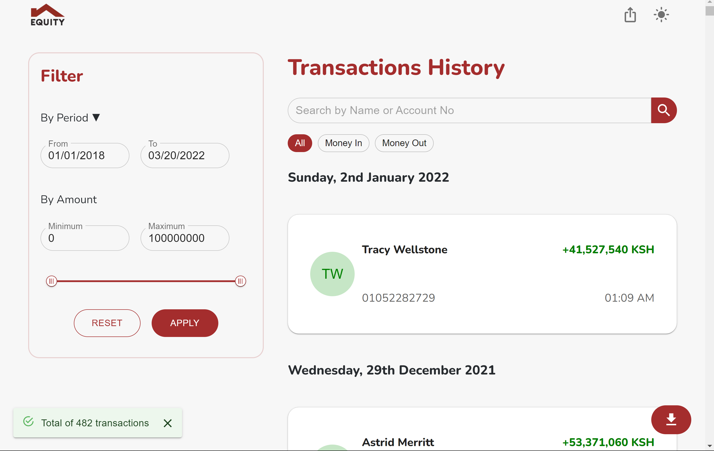

# MT940(Customer Message Statement)

Access the site at [https://equity.riviatechs.com](https://equity.riviatechs.com)

Submission solution for the equity hackathon.  
For full information about the challenge visit [https://github.com/riviatechs/equity-report](https://github.com/riviatechs/equity-report).

This solutions meets the following the following objectives:-

1. Develop a configurable widget to download MT940s in various formats e.g xls, pdf, or free formats that allows selection and formatting of columns(column layout, content, etc)

2. A widget which the bank would then consume from within equity platform via API calls.

3. Users to be able to select the columns and layout from the raw format via a simple UI

4. Easily download the selected MT940 data and corresponding columns in various file types

## Deployment

### Staging

service-name: mt940-website  
Region: us-central1  
url: [https://mt940-website-s47opgtmgq-uc.a.run.app](https://mt940-website-s47opgtmgq-uc.a.run.app)

### Production

#### Link to the app

- [https://equity.riviatechs.com](https://equity.riviatechs.com)

- [Setting-up-a-global-https-load-balancer](2)

- External IP addresses

name: mt940-website-ip  
address: 34.110.166.190

- Create a serverless NEG

name: mt940-website-neg  
cloud-run-service: mt940-website

- Create a backend service

name: mt940-website-bsn

- Create a URL map

name: mt940-website-url-map

- To create a Google-managed SSL certificate resource

name: mt940-website-ssl  
domain: equity.riviatechs.com

- Create a target HTTP(S) proxy to route requests to your URL map

name: mt940-website-target-https-proxy

- Create a global forwarding rule to route incoming requests to the proxy

name: mt940-website-forwarding-rule

- Update your load balancer with SSL certificate  
  [Redirect-HTTP-to-HTTPS](1)

[1]: https://cloud.google.com/load-balancing/docs/https/setting-up-http-https-redirect#console "Redirect HTTP to HTTPS"
[2]: https://cloud.google.com/load-balancing/docs/https/setting-up-https-serverless#gcloud_1 "Setting up a global external HTTP(S) load balancer (classic) with Cloud Run"
